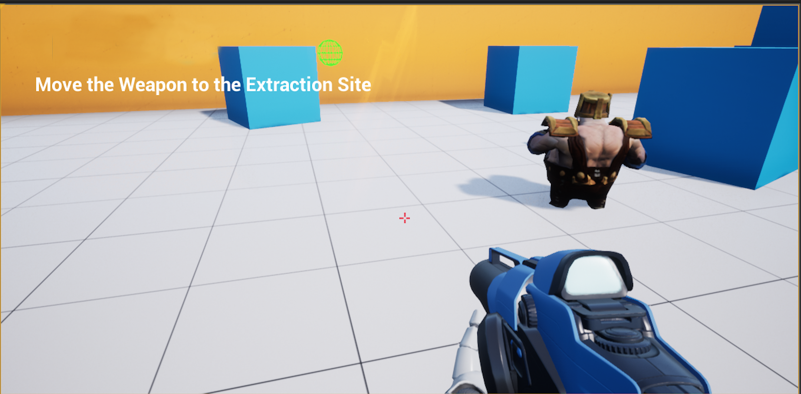

# CPP-Stealth-Game
This game is a first person stealth game, developed using C++ in Visual Studio and Unreal Engine 4

The objective of the game is to distract the guard, collect the objective, and return the objective to an extraction zone.

The guard is seen here on the right. The character has a weapon that fires projectiles that make a sound when bouncing off the surface of an object.

The guard can both see and hear the player. If the player is spotted by the guard the game ends.

In this screenshot the projectile has been fired at the wall behind the guard. He turns around to see the source of the sound (green sphere on wall is a visualization of the noise).

With the guard disctracted the player is able to move in and collect the objective. Once picked up the objective emits an orange smoke and the objective text on screen changes. 

The guard will turn around if the player moves too close or several seconds after hearing the projectile.

Once the objective is collected the player can move to a designated extraction site while avoiding the guards sight lines. If the player grabs the objective and reaches the extraction site unseen the game is successfully completed.

This project was based on the online course: [Unreal Engine 4 Mastery: Create Multiplayer Games with C++](https://www.udemy.com/unrealengine-cpp/?couponCode=EGTL1099)
